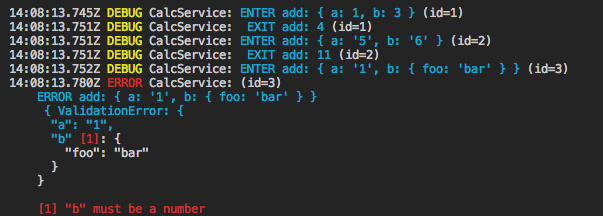
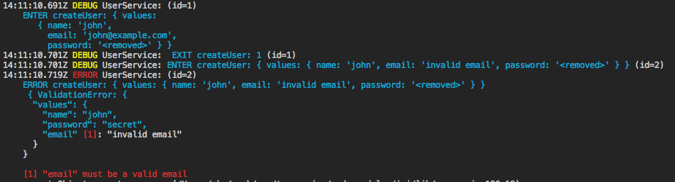
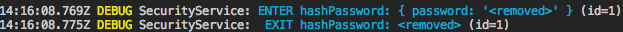

# Typescript Contract

ts-contract is a TypeScript library for validation and logging.  
It depends on [joi](https://github.com/hapijs/joi) (validator) and [bunyan](https://github.com/trentm/node-bunyan) (logger)  

**NOTE** Works only with Typescript 2.8+.

[](https://greenkeeper.io/)
[](https://travis-ci.org/effectivex/ts-contract)
[](https://codecov.io/gh/effectivex/ts-contract)
[](https://david-dm.org/effectivex/ts-contract?type=dev)


### About
The motivation is to provide a library for [contract programming](https://en.wikipedia.org/wiki/Design_by_contract) that works well with TypeScript.  
There are many existing libraries for data validation that rely heavily on decorator annotations. Unfortunately, decorators have many flaws:
- it's an experimental feature, and its syntax is going to change,
- redundant syntax because we must create special classes instead of using plain objects,
- it's a runtime feature, and there are some [bugs related to reflection](https://github.com/kulshekhar/ts-jest/issues/439),
- no type inference, any typos or mistakes cause a runtime error instead of a compilation error.

 Since Typescript 2.8, it's possible to use [conditional types](https://github.com/Microsoft/TypeScript/pull/21496), that allow us to map one type to another. It's a powerful feature that can extract a Typescript interface from the Joi validation schema.

 See the example below. There are no TypeScript annotations. It's pure JavaScript code, but we have type checking inferred from Joi.


### Features

- Full type inference for input parameters extracted from the Joi schema definition.
- Input validation and normalization (example: string type `"2"` to number type `2`).
- Input logging (input parameters):
```
myService: ENTER methodName: {param1: 'foo', param2: 'bar'}
```
- Output logging (sync and async):
```
myService:  EXIT methodName: {result: 'foobar', anotherProp: 'bar'}
```
- Error logging with input parameters (see example below).

### Contract Programming


### Getting Started

```bash
npm install ts-contract
```
```bash
yarn add ts-contract
```

## Example usage 
```ts
// services/CalcService.ts
import { Joi, contractProvider } from 'ts-contract';

// It's recommended that you configure the provider once and all
const contract = contractProvider();

export const add = contract(
  'CalcService#add',
  ['a', 'b'],
  {
    a: Joi.number().required(),
    b: Joi.number().required(),
  },
  (a, b) => a + b,
  { sync: true },
);

```

use service
```ts
// app.ts
import * as CalcService from './services/CalcService';


CalcService.add(1, 3); // returns 4
CalcService.add('5' as any, '6' as any); // returns 11, input parameters are converted to number types
CalcService.add('1' as any, { foo: 'bar' } as any); // logs and throws an error
// NOTE: you shouldn't use casting `as any` in your code. It's used only for a demonstration purpose.
// The service is expected to be called with unknown input (for example: req.body).
```



See example under `examples/example1.ts`. Run it using `npm run example1`.


## Async example usage
file `services/UserService.ts`
```ts
// services/CalcService.ts
import { Joi, contractProvider } from 'ts-contract';

const contract = contractProvider();

export const createUser = contract(
  'UserService#createUser',
  ['values'],
  {
    values: Joi.object({
      name: Joi.string()
        .required()
        .alphanum(),
      email: Joi.string()
        .required()
        .email(),
      password: Joi.string()
        .required()
        .min(5),
    }).required(),
  },
  async values => {
    // do something with values
    // UserModel.create(values);
    const id = 1;
    return id;
  },
);

```

use service
```ts
// app.ts
import * UserService from './services/UserService';

await UserService.createUser({
  name: 'john',
  email: 'john@example.com',
  password: 'secret',
}); // ok
await UserService.createUser({
  name: 'john',
  email: 'invalid email',
  password: 'secret',
}); // throws an error
```



See example under `examples/example2.ts`. Run it using `npm run example2`.  


## Removing security information
By default properties `password`, `token`, `accessToken` are removed from logging.  
Additionally you set options to `{removeOutput: true}` to remove the method result.  
Example:

file `services/SecurityService.ts`
```ts
// services/SecurityService.ts
import { Joi, contractProvider } from 'ts-contract';

const contract = contractProvider();

export const hashPassword = contract(
  'SecurityService#hashPassword',
  ['password'],
  {
    password: Joi.string().required(),
  },
  password => 'ba817ef716',
  { sync: true },
);

```

use service
```ts
// app.ts
import * as SecurityService from './services/SecurityService';

securityService.hashPassword('secret-password');
```



See example under `examples/example3.ts`. Run it using `npm run example3`.


## API Docs
```ts
import {contractProvider} from 'ts-service';

const contract = contractProvider({
  removeFields: string[], // the array of fields not won't be logged to the console, default: ['password', 'token', 'accessToken'],
  debug: boolean,         // the flag if ENTER and EXIT logging is enabled, (errors are always enabled), default: true
  depth: number,          // the object depth level when serializing, default: 4           
  maxArrayLength: number, // the maximum number of elements to include when formatting an array, default: 30  
  getLogger: (serviceName: string) => Logger, // a function to create a new bunyan logger instance for the given service.
                                              // default: creates a logger with options {name: serviceName, level: this.debug ? 'debug' : 'error' }
  getNextId: () => number // a function to get the next service call id, default: function that returns sequence 1,2,3 ...
})
```

You must configure it, before creating any service.

## Special properties
if the parameter name is `req` it's assumed that the object is an express request.  
Only properties are logged: `method`, `url`, `headers`, `remoteAddress`, `remotePort`.  


if the parameter name is `res` it's assumed that the object is an express response.  
Only properties are logged: `statusCode`, `header`.  

<!-- ### Docs
[API Reference](https://effectivex.github.io/ts-contract/) -->

### License
MIT